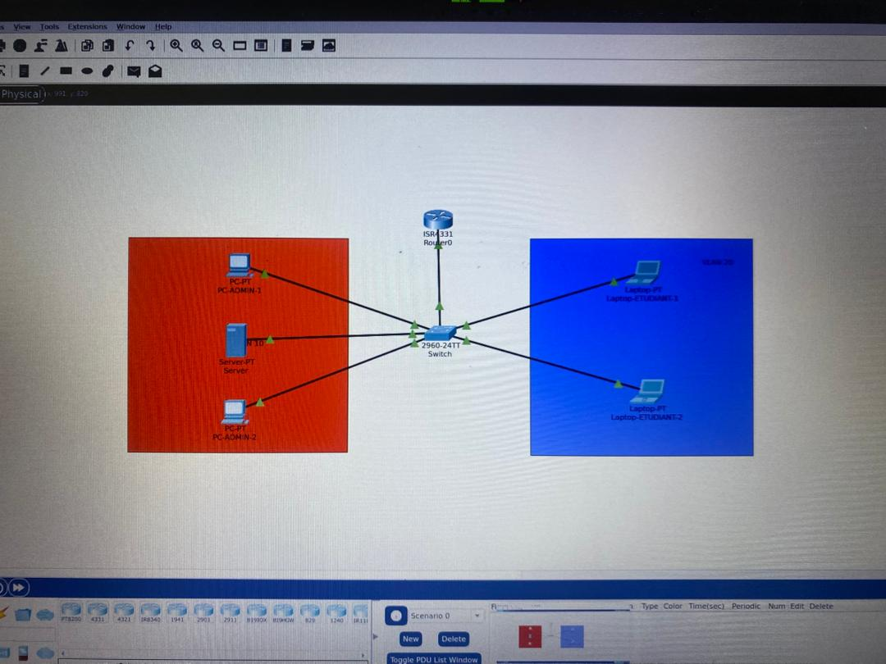

# Portfolio

# École Supérieure d’Informatique et de Gestion

## ESIG GLOBAL SUCCESS

# 🔐 PORTFOLIO – SEMESTRE 

**Filière : Réseaux & Sécurité Informatique (1ère Année)**

**Nom :** MIDAGBODJI

**Prénoms :** KOAMI DAVID

**Matricule :** ESIG-03237-2025

**Promotion :** 2025-2026

## 🧾 Introduction 

Au cours du semestre, j’ai poursuivi ma formation en réseaux et sécurité informatique en consolidant mes connaissances théoriques et en développant des compétences pratiques à travers des travaux dirigés, des projets et des SAE (Situations d’Apprentissage et d’Évaluation).

Ce semestre m’a permis de mieux comprendre le fonctionnement des systèmes informatiques, des réseaux et des mécanismes de sécurisation. J’ai également appris à utiliser différents outils professionnels et à travailler sur des projets concrets, notamment la mise en place d’une infrastructure réseau,Base de donnée,etc.

À travers ces expériences, j’ai développé une approche plus rigoureuse du travail, une capacité d’analyse technique et une meilleure autonomie. Ce portfolio présente un bilan structuré de mes compétences, de mes acquis et de mon évolution dans le cadre de mon projet professionnel orienté vers la cybersécurité.

# 1. 📊 Bilan des UE du semestre 

## 1.1 🔹 Bloc de compétence 1 : Programmation

**Compétences développées :**

* Compréhension des bases de la programmation
* Logique algorithmique
* Écriture de programmes simples

**Cours/activités :**

* Travaux pratiques en langage C
* Exercices d’algorithmes

**Analyse réflexive :**
Ces compétences me permettent de mieux comprendre le fonctionnement des applications et constituent une base importante pour la cybersécurité (analyse de scripts, automatisation).

## 1.2 🔹 Bloc de compétence 2 : Réseaux Informatiques

**Compétences développées :**

* Configuration d’adresses IP
* Compréhension des protocoles (TCP/IP, DNS, DHCP)
* Notions de segmentation réseau

**Cours/activités :**

* Travaux pratiques sur simulateur réseau
* Mise en place de topologies réseau

**Analyse réflexive :**
Ces compétences sont essentielles pour mon projet professionnel, car la sécurité repose sur une bonne maîtrise des réseaux.

## 1.3 🔹 Bloc de compétence 3 : Bases de Données

**Compétences développées :**

* Conception de bases de données
* Requêtes SQL
* Gestion des données

**Cours/activités :**

* Création de bases de données
* Manipulation avec SQL

**Analyse réflexive :**
La maîtrise des bases de données est importante pour sécuriser les informations et gérer les accès aux données.

## 1.4 🔹 Bloc de compétence 4 : Administration Systèmes

**Compétences développées :**

* Installation de systèmes Linux
* Gestion des utilisateurs
* Configuration des services

**Cours/activités :**

* Installation de serveurs Linux
* Travaux pratiques en virtualisation

**Analyse réflexive :**
Ces compétences sont au cœur de mon objectif professionnel, car la sécurité informatique passe par une bonne administration des systèmes.

## 1.5 🔹 Bloc de compétence 5 : Mathématiques

**Compétences développées :**

* Logique mathématique
* Résolution de problèmes
* Raisonnement analytique

**Cours/activités :**

* Exercices pratiques
* Applications en informatique

**Analyse réflexive :**
Les mathématiques renforcent ma capacité à analyser et résoudre des problèmes techniques en informatique.

# 2. 📚 Bilan des SAE du semestre 

## 2.1 🧠 Savoirs acquis

### 2.1.1 🔹 SAE – Infrastructure Réseau “Petit Prince”

**Savoirs théoriques :**

* Architecture réseau
* Segmentation et organisation d’un réseau
* Fonctionnement des services (DHCP, DNS)
* Notions de sécurité (pare-feu, SSH)

### 2.1.2 🔹 SAE – Déploiement de services informatiques

**Savoirs théoriques :**

* Fonctionnement des serveurs
* Virtualisation
* Conteneurisation (Docker)

## 2.2 ⚙️ Compétences des SAE

### 2.2.1 🔹 Compétences – SAE Infrastructure Réseau

* Analyse des besoins d’un établissement
* Conception d’un réseau
* Mise en place d’une infrastructure virtualisée
* Sécurisation des accès

### 2.2.2 🔹 Compétences – SAE Déploiement

* Installation de services
* Gestion de conteneurs
* Administration système

#### 🔹 SAE – Gestion de base de données : Cas d’une clinique

Dans le cadre de cette SAE, j’ai travaillé sur la conception et la gestion d’une base de données pour une clinique. Ce projet m’a permis d’acquérir plusieurs connaissances théoriques essentielles :

* Compréhension du modèle relationnel
* Conception d’un schéma de base de données (tables, attributs, relations)
* Notions de clés primaires et clés étrangères
* Normalisation des données (éviter la redondance)
* Utilisation du langage SQL pour interroger une base de données
* Gestion des opérations CRUD (Create, Read, Update, Delete)

Ce projet m’a permis de comprendre comment organiser efficacement des données dans un contexte réel (patients, médecins, consultations).

### 2.3 ⚙️ Compétences développées

#### 🔹 SAE – Gestion de base de données : Cas d’une clinique

À travers cette SAE, j’ai développé des compétences techniques et professionnelles importantes :

* Création de tables avec SQL
* Écriture de requêtes SQL (SELECT, INSERT, UPDATE, DELETE)
* Mise en place de relations entre les tables (patients, rendez-vous, médecins)
* Extraction d’informations pertinentes (ex : liste des patients, historique des consultations)
* Résolution de problèmes liés aux données
* Structuration logique d’un système d’information

### 📊 Analyse réflexive

Cette SAE m’a permis de comprendre l’importance des bases de données dans la gestion des systèmes informatiques. Dans un domaine comme la santé, une bonne organisation des données est essentielle pour garantir la fiabilité et la sécurité des informations.

Les compétences acquises en SQL et en modélisation de données contribuent directement à mon projet professionnel en cybersécurité, car la protection des données sensibles (comme les données médicales) est un enjeu majeur.

Ce projet m’a également permis de développer ma rigueur, ma logique et ma capacité à travailler sur des cas concrets proches du monde professionnel.

.png)

.png)
# 🏫 Projet Principal : Infrastructure Réseau – Établissement “Petit Prince”

## 📌 Contexte

Projet de conception et de déploiement d’un réseau informatique pour un établissement scolaire.

## 🎯 Objectifs

* Fournir un réseau fonctionnel
* Assurer la sécurité
* Garantir la disponibilité

## ⚙️ Réalisations

* Installation de serveurs Linux
* Configuration réseau
* Mise en place de services
* Sécurisation (pare-feu, SSH)

## 🧪 Outils utilisés

* Ubuntu Server
* Virtualisation
* Docker
* Cisco Packet Tracer

## 📈 Résultats

* Réseau stable et fonctionnel
* Accès sécurisé
* Bonne organisation

# 🚀 Conclusion

Ce semestre m’a permis de développer des compétences solides en réseaux, systèmes et sécurité informatique. Les SAE ont été particulièrement importantes pour appliquer mes connaissances dans des situations réelles.

Je souhaite continuer à progresser dans le domaine de la cybersécurité et approfondir mes compétences afin de devenir un professionnel capable de sécuriser des infrastructures informatiques.

# 📞 Contact

* Email : [lemineurdiarra@gmail.com](mailto:lemineurdiarra@gmail.com)
* GitHub : [https://github.com/lemineurdiarra-droid](https://github.com/lemineurdiarra-droid)

## ⚠️ Remarque

Tous les projets présentés ici sont réalisés dans un cadre éducatif et respectent les règles d’éthique en cybersécurité.
